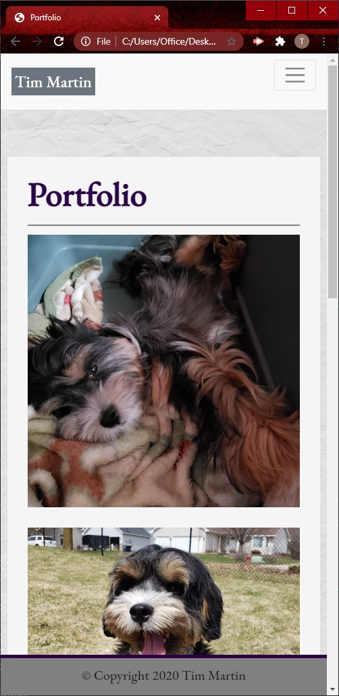
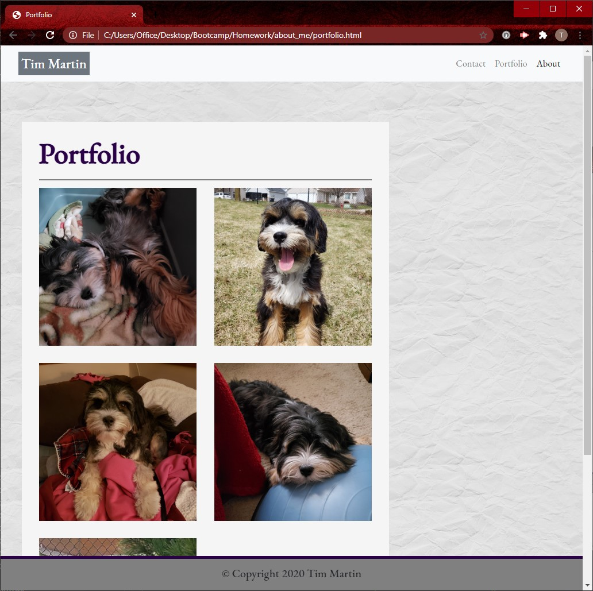
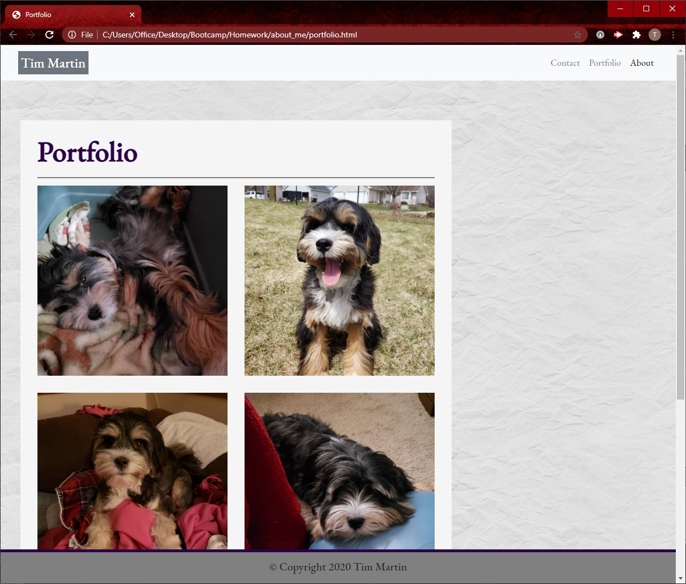

# about_me
A responsive About Me website to start putting together a personal portfolio.  The elements move around based on the size of teh screen viewing it.  There are three pages, an About Me, a Contact me, and a Portfolio page.  You can enter your contact info and submit it to me but at this point it goes nowhere so I will never see it, but enjoy puppy pictures.

Screen shots:

About Me:

Contact:

Portfolio:

Github link: https://github.com/TimMartin13/about_me

Published link: https://timmartin13.github.io/about_me/.

